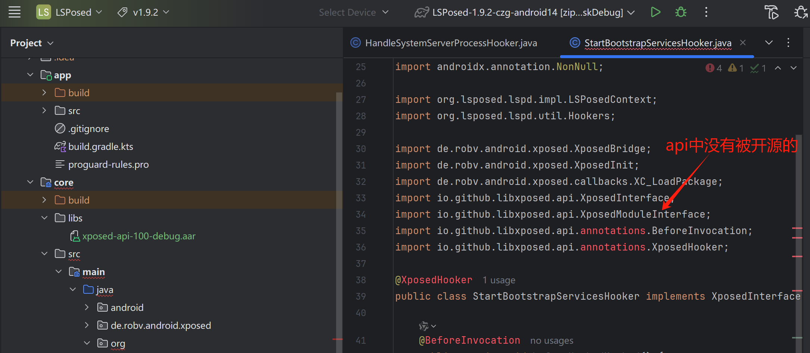
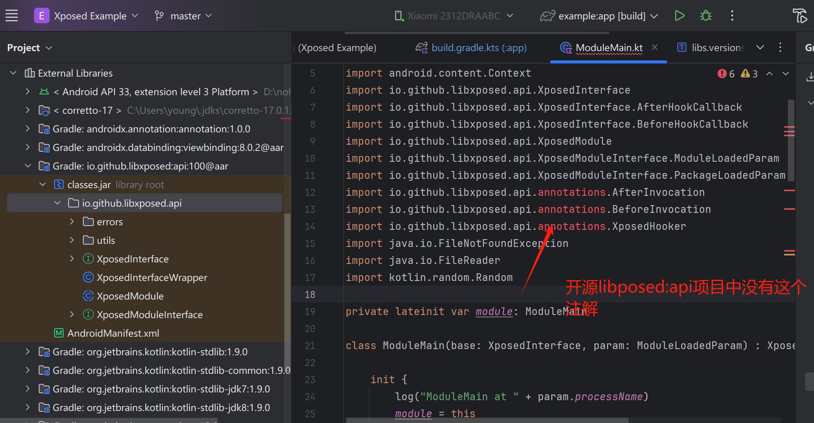

# 编译环境说明
  jkd-17
  Android Studio Meerkat | 2024.3.1

# github上for出来的缺少了annotations部分的几个文件
 1： 在https://gitlab.com/xposed_grp/LSPosed/libxposed/api/-/tags 找到 “标记/加注解”，并下载
错误信息

# 编译lpsoed之前需要编译并发布到本地仓库
~~~
拉取libxposed
git clone --depth 1 https://github.com/libxposed/api.git libxposed/api
git clone --depth 1 https://github.com/libxposed/service.git libxposed/service
#编译并发布到本地仓库
cd libxposed/api
./gradlew :api:publishApiPublicationToMavenLocal
cd ../service
#需要JetBrains-21.0.7--改为jkd17，否则在lsposed项目中将无法使用
./gradlew :interface:publishInterfacePublicationToMavenLocal

./gradlew :service:publishServicePublicationToMavenLocal
cd ../../
./gradlew zipAll

~~~
